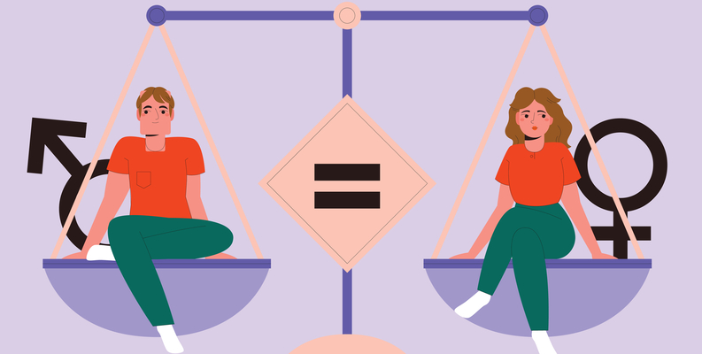

# **Equalize**
This program is actually an academic project which is a part of the 01219116-65 Programming II Second Semester, 2022. at Kasetsart University.

## Description
Equalize is a regression and analysis program, Its main function is to visually represent processed data using different types of graphs. Additionally, it can also utilize basic machine-learning techniques to make predictions based on the data. You can find the program introduction video at the following link.

URL: https://youtu.be/Z6b_oB-_b9g



## Data Sources
The Gender Inequality Index (GII) dataset provides a comprehensive measure of gender inequality across countries, capturing gender disparities in health, education, and economic opportunities. 
Developed by the United Nations Development Programme (UNDP), the GII measures gender inequality by analyzing health, empowerment, and labor market participation indicators. 
This dataset includes GII scores, as well as component scores for each indicator, for over 190 countries, in 2021.<br>
URL: https://www.kaggle.com/datasets/gianinamariapetrascu/gender-inequality-index

## Running the Application
Since some of Equalize's functions couldn't be done by using just the python built-in modules, So here is some additional requirements for the user to run Equalize.
### Requirements:
- `customtkinter`: A customized version of the Tkinter module for creating graphical user interfaces (GUIs).
- `matplotlib`: A plotting library used to create high-quality visualizations and graphs.
- `networkx`: A Python package for studying complex networks, including their analysis and visualization.
- `numpy`: A powerful library for numerical computations, providing support for arrays, matrices, and mathematical functions.
- `pandas`: A data manipulation and analysis library offering data structures and operations for efficient data handling.
- `Pillow`: A library for image processing tasks, including opening, manipulating, and saving different image formats.
- `pycountry`: A module for accessing country-related information, such as country codes, names, and geographical details.
- `pygame`: A cross-platform library for developing video games and multimedia applications.
- `scikit_learn`: A machine learning library that provides various algorithms for classification, regression, clustering, and more.
- `seaborn`: A data visualization library built on top of matplotlib, offering enhanced statistical graphics and attractive visualizations.<br>

<p>You can install dependencies by following command.</p>

```bash
pip install -r requirements.txt
```

### Launch Instructions
Make sure you have all the required software installed.
```bash
~/ > git clone https://github.com/SirisilpK/year-project-Jwizzed.git
~/ > cd YearProject
~/ > pip install -r requirements.txt
 > python main.py
```

## Design
The program has 12 classes including the "main" class, 10 of them are in the presentation layer and the other one is in the domain layer.
### Program Design
#### Classes in the presentation layer:
- `App`: The root window of the GUI
- `MenuFrame`: The home frame when starting the program.
- `RightMenuFrame`: Subframe of `MenuFrame`.
- `LeftMenuFrame`: Subframe of `MenuFrame`.
- `AppFrame`: The app frame inside the application contains the menu and information.
- `WindowSubFrame`: Subframe of `AppFrame`.
- `NavigationSubFrame`: Subframe of `AppFrame`.
- `PlotFrame`: The frame for visualizing a graph.
- `CommonWidget`: The class contains the generating widgets function.
- `FacadeController`: Interact with all of the classes.
#### Class in domain layer:
- `Analysis`: The class handles the backend stuff.
### Code Structure
[equalize.py](equalize.py) : Contain `App`

[menuFrame.py](menuFrame.py) : Contains `MenuFrame`, `RightMenuFrame`, and `LeftMenuFrame`

[appFrame.py](appFrame.py) : Contains `AppFrame`, `NavigationSubFrame`, and `WindowSubFrame`

[plotFrame.py](plotFrame.py) : Contain `PlotFrame`

[facadeController.py](facadeController.py) : Contain `FacadeController`

[commomWidget.py](commomWidget.py) : Contain `CommonWidget`

[model.py](model.py) : Contain `Analysis`

 
## Design Patterns Used
The program used a Facade pattern, I create a FacadeController class in the presentation layer, FacadeController response to interacting between both the classes in the presentation layer and the class in the domain layer. which means FacadeController can handle either the GUI part or the data part at the same time.
 
## Graph Algorithm Used
For the graph modeling, you can check it in this google docs link.

URL: https://docs.google.com/document/d/1Hk3V98_qcQOWNQNmbM0RyW5zsmLybRyC47IjUTlAhv8/edit?usp=sharing
 
## Other features
Besides the main functions part, I also add some properties in the code and it might be a little confusing of what is it so here is a quick guide.
- `A tree table`: If you ever enter the visualized screen or in the regression section, you might see that there is a table and an entry box but you might don't know how to use it, A tree table is made for someone who has a basic of python language if you want to search for something you're going to type it in python style. For example, if you to filter the table to have only Congo data, instead of typing "Congo" and clicking search, you will need to type "Country == 'Congo'" and if you need to see the data that has GII more than 0.5 you can type "GII > 0.5".
- `Graph color`: As you can see in the plot menu, There will have a pick color 1, 2,3, and 4 but in some graph that only has 1 color, you'll need to change the color 1 and the other color doesn't matter for that graph type.
- `Appearance mode`: The program has 2 appearances mode which is "Dark" and "Light", You can choose whatever you want but I prefer you to use a "Dark" mode.
- `Music`: The program has a toggle button that is going to play and pause the music, if you're the one who loves music, make sure you try this one.
- `Back to the menu`: After you click start in the main menu, you can click on the word "Equalize" at the upper left of your screen to go back to the main screen.